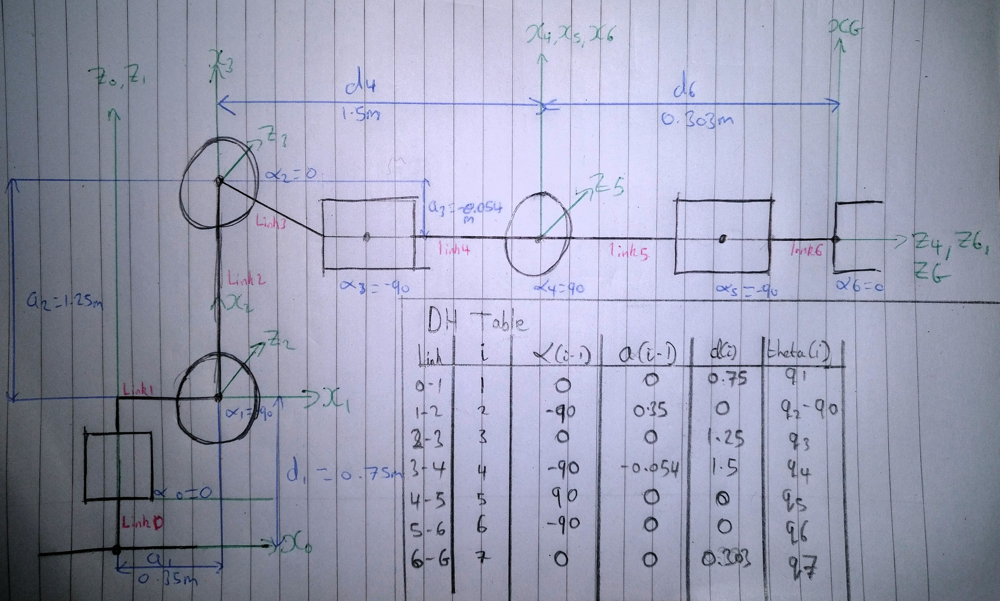
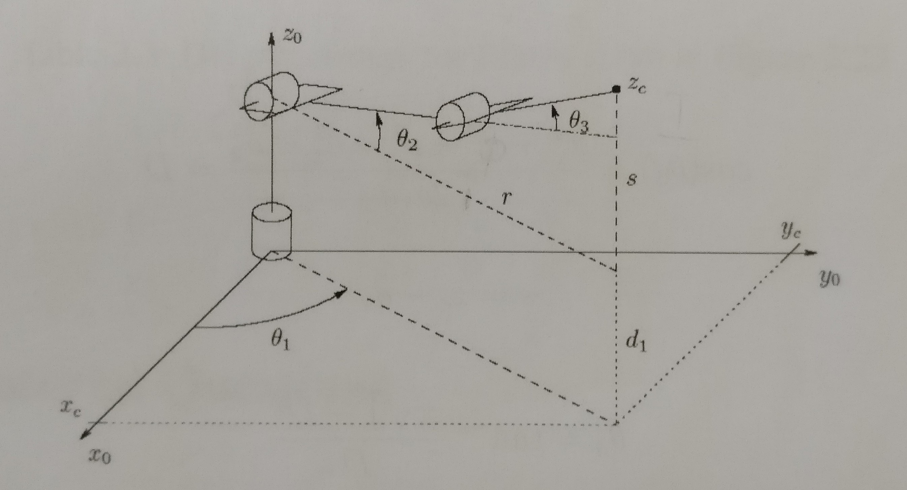
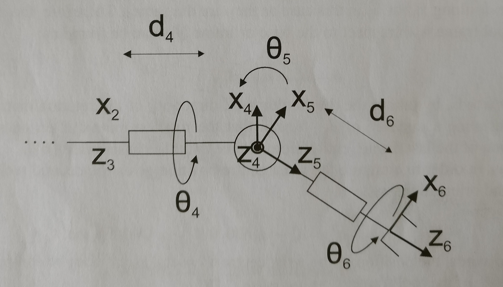
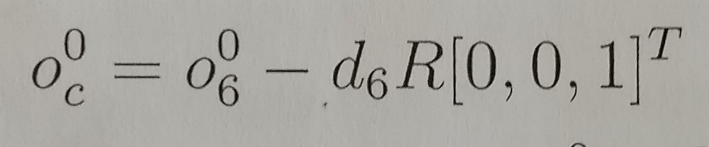
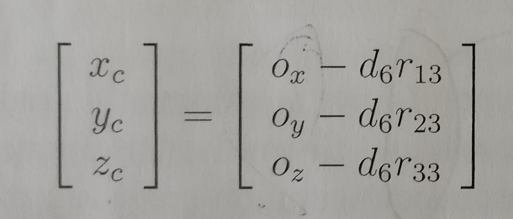
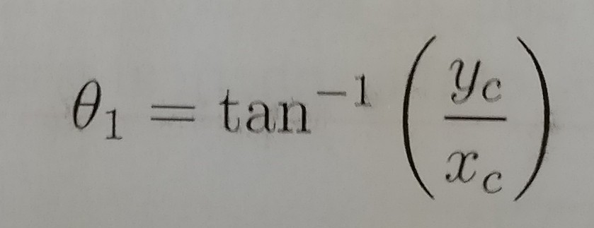
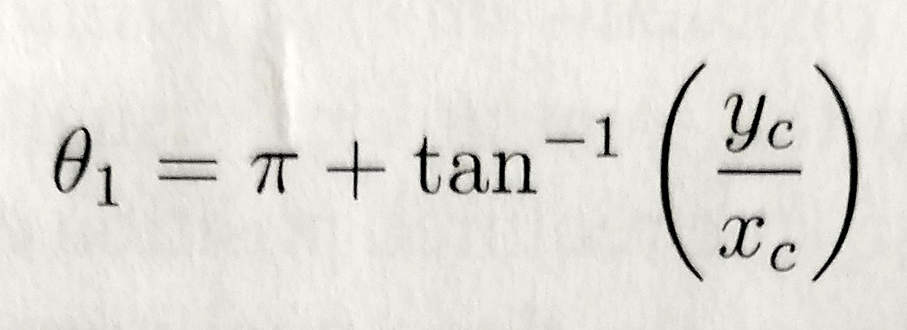
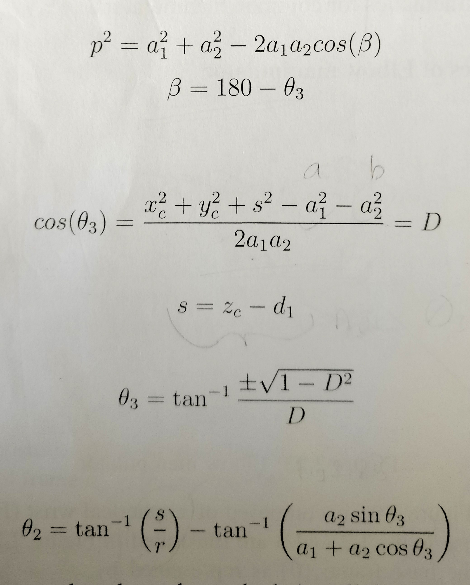
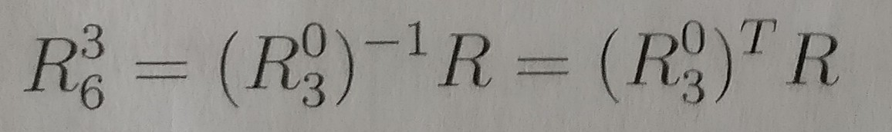

# Project: Kinematics Pick & Place

## [Rubric](https://review.udacity.com/#!/rubrics/972/view) Points

## Rubric Points

### Kinematics Analysis

#### Rubric 1
   Run the forward_kinematics demo and evaluate the kr210.urdf.xacro file to 
   perform kinematic analysis of Kuka KR210 robot and derive its DH parameters.

   Your writeup should contain a DH parameter table with proper notations and 
   description about how you obtained the table. Make sure to use the modified 
   DH parameters discussed in this lesson. Please add an annotated figure of 
   the robot with proper link assignments and joint rotations (Example figure 
   provided in the writeup template). It is strongly recommended that you 
   use pen and paper to create this figure to get a better understanding of 
   the robot kinematics.

   - Image 1 below demonstates the reference frames chosen for the Kuka KR210
     robot. The figure contains a schematic of the joints and links; the joints
     are the circles and the rectangles in different orientation, all connected
     by links (lines labelled in red text).

   - DH reference frame choice
      - The 'z' axis' were chosen as the axis of rotation for each joint.
      - The 'x(i)' axis' were chosen to be perpendicular to z(i) and z(i-1).
        In the case z(i) and z(i-1) were parallel, x(i) must be perpendicular
        to the plane generated by z(i) and z(i-1). 
   - Thus, the values of alpha, a, d, and theta were inferred from the reference
     frame definition.
   - The values of alpha, a, d, and theta were determined via the file:
     'kr210.urdf.xacro', resulting in the DH table in Image 1.
   - The key notes for this stage were including the link6 length to the gripper
     in the value d6 as it was not in the 'link' section of the xacro file.

#### Rubric 2
   Using the DH parameter table you derived earlier, create individual 
   transformation matrices about each joint. In addition, also generate a 
   generalized homogeneous transform between base_link and gripper_link using 
   only end-effector(gripper) pose.

   Your writeup should contain individual transform matrices about each joint 
   using the DH table and a homogeneous transform matrix from base_link to 
   gripper_link using only the position and orientation of the gripper_link. 
   These matrices can be created using any software of your choice or hand 
   written. Also include an explanation on how you created these matrices.

   - In 'Forward_Kinematics.py', the individual transform matrices are generated
     by applying a generalised forumla in TF_Matrix to each row of the DH table
     (stored in DH_Table as a dictionary). This generates T0_1 to T6_EE. NOTE:
     the correctional matrix (R_Corr) was added for 'IK_server'. 
   - Furthermore the generalised homogenous transform matrix from the base to
     the end-effector was generated by multiplying all of the individual 
     transformation matrices, and outputted as T0_EE.

#### Rubric 3
   Decouple Inverse Kinematics problem into Inverse Position Kinematics and 
   inverse Orientation Kinematics; doing so derive the equations to calculate 
   all individual joint angles.

   Based on the geometric Inverse Kinematics method described here, breakdown 
   the IK problem into Position and Orientation problems. Derive the equations 
   for individual joint angles. 
   Your writeup must contain details about the steps you took to arrive at 
   those equations. Add figures where necessary. 
   If any given joint has multiple solutions, select the best solution and 
   provide explanation about your choice (Hint: Observe the active robot 
   workspace in this project and the fact that some joints have physical 
   limits).

   - The inverse kinematics problem is broken down into two main stages; the
     position (Image 2) and orientation problem (Image 3).

##### Image 2- Diagram of position problem

##### Image 3- Diagram of orientation problem

 
   - The positional calculation begins by calculating the wrist center from the
     known end-effector position (Image 4 & 5).  

##### Image 4- Wrist centre position as a function of end-effector position
##### and 'd6'

##### Image 5- Wrist centre position in matrix form.

   - With the x,y,z coordinates known from Image 5, it is then possible to
     calculate theta's 1,2 and 3 in Image 2 using the following formulas:

##### Image 6 & 7- calculating both theta 1's

##### Image 8- Calculating theta 2 & 3

   - The orientation problem (Image 3) can then infer the values of theta 4-6.
   - Firstly given theta 1-3 the rotational matrix R0_3 to the wrist centre can
     be calculated and therefore the R3_6 matrix can be equated to:

##### Image 9- R3_6 Equation

   - Given R3_6, theta 5 is calculated by knowing the Euler ZYZ matrix 
     (Image 10) where alpha, beta and gamma correspond to theta 4-6. 
   - In the Inverse_Kinematics.py file this is simply:

''' python
theta4 = atan2(R3_6[2,2], -R3_6[0,2])
theta5 = atan2(sqrt(R3_6[0,2]*R3_6[0,2] + R3_6[2,2]*R3_6[2,2]), R3_6[1,2])
theta6 = atan2(-R3_6[1,1], R3_6[1,0])
'''

   - In IK_server.py the values of theta 4 and 6 were selected in the
     following section:

''' python
    # Euler angles from rotation matrix
    theta5 = atan2(sqrt(R3_6[0,2]*R3_6[0,2] + R3_6[2,2]*R3_6[2,2]),R3_6$

    # choose theta 4 and 6 (CAST)
    if (theta5 > pi) :
        theta4 = atan2(-R3_6[2,2], R3_6[0,2])
        theta6 = atan2(R3_6[1,1],-R3_6[1,0])
    else:
        theta4 = atan2(R3_6[2,2], -R3_6[0,2])
        theta6 = atan2(-R3_6[1,1],R3_6[1,0])
''' 

   - The resulting code performed as below in IK_debug.py:

### Project Implementation

#### Rubric 4
   Fill in the IK_server.py file with properly commented python code for 
   calculating Inverse Kinematics based on previously performed Kinematic 
   Analysis. Your code must guide the robot to successfully complete 8/10 
   pick and place cycles. A screenshot of the completed pick and place process 
   is included.

   IK_server.py must contain properly commented code. The robot must track the 
   planned trajectory and successfully complete pick and place operation. 
   Your writeup must include explanation for the code and a discussion on the 
   results, and a screenshot of the completed pick and place process.

   - The code in IK_server.py has the following additions:
      - Reducing the forward kinematics calculations to FK.pickle and importing
        it in: 

''' python
    # Load pre-formed forward kinematic formulas
    pickle_in = open("FK.pickle", "rb")
    FK = pickle.load(pickle_in)
'''

   - The Photos directory contains snapshots of a complete inverse-kinematics
     pick and place operation in 'Complete_Run'
   - Folders Run_1-3 demonstrate that the code is capable of performing the 
     complete operation in ~ 2 minutes. (Inferred from the photo name which 
     contains start and end time)
   - Please feel free to run code to confirm. 
